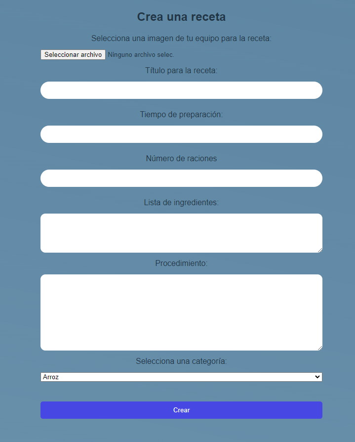

Aplicación de recetas y categorías realizada con React y Laravel. 

## Uso
Los ficheros del framework Laravel y dependencias se encuentran embebidos en la carpeta principal. Los pertenecientes a React y la parte Frontend se encuentran en el interior de la carpeta "recetas_react".
Para poner a disposición de uso la aplicación, una vez clonada, se deberán ejecutar los siguientes comandos:

**Laravel**

-Para instalar los paquetes y dependencias:
```
php composer.phar update

```

-Habilitar base de datos:
```
php artisan migrate:fresh --seed

```
Se procederá a la generación de datos de prueba para los modelos: User,Recipe,Category; provenientes de los ficheros Factory generados con Faker.

-Por último, para iniciar el servidor:
```
php artisan serve

```

**React/Vite**

-Situandonos en la carpeta adecuada instalaremos las dependencias necesarias:
```
cd recetas_react
npm install

```
-Para iniciar:

```
npm run dev
```

**.env**

Para poder rellenar los datos del fichero .env, existe un fichero de ejemplo(.env.example) donde están volcados los mismos campos utilizados en la parte del servidor.

En el caso del fichero perteneciente a la sección del front, la única variable de entorno utilizada es la siguiente:

```
VITE_BACKEND_URL=
```
En ella se aporta la URL de local host. Ej: http://localhost:5000


**Imágenes**

Existe la opción de almacenar imágenes en la misma aplicación, en la carpeta 'storage\app\images'. Se utilizan las rutas locales para la implementación en la aplicación. Para la generación de datos de prueba, hay 10 imágenes con sus respectivas rutas asociadas aleatoriamente a las distintas recetas:


 

 


## Vistas

**Home '/'**


 

Encontramos un despliegue de las Categorías existentes en la base de datos ordenadas por orden alfabético. En la parte inferior de cada una de ellas, se encuentran todas las recetas que tienen esta misma como categoría. Las recetas están ordenadas en función de la fecha en la que fueron creadas.
Para movernos a través de la lista de recetas, tendremos que arrastrar pulsando en alguna de ellas. Cada título de Categoría es un enlace que dirige a su vista detalle.


**Categoría Detalle '/category/{slug-categoria}'** 

y

**Receta Detalle '/recipe/{slug-recipe}'**

 


Dentro de la vista detalle de Categoría encontramos la lista de las recetas que pertenecen a ella. Cada receta contiene en su título un enlace que dirige a su vista detalle.
En la vista detalle de Receta encontramos algunos detalles añadidos sobre esta.


**Login '/login'**

 


El Admin tendrá acceso con una cuenta autorizada para hacer variaciones en los registros de datos. A través de las credenciales correctas y la autenticación realizada en el servidor, tendrá acceso a las vistas y funciones reservadas.


## CRUD Dashboard


**Crear Receta y Categoría**

 

Con el rellenado del formulario y validación de los datos y ficheros introducidos se creará un nuevo registro en las tabla (Recetas o Categorías) y se sobrescribirá la lista mostrada en pantalla.


**Eliminar y Actualizar**


Tenemos la opción también de eliminar el registro pulsando en el botón. Si se trata de una Categoría, todas las Recetas que se encuentren dentro de esta serán eliminadas también. También en este caso se sobrescribirá la lista mostrada en pantalla.
Para la función de edición o actualizar, rellenaremos los campos para sustituir los ya vigentes. En caso de no rellenar algún campo se mantendrán los que ya tuviese el registro.
